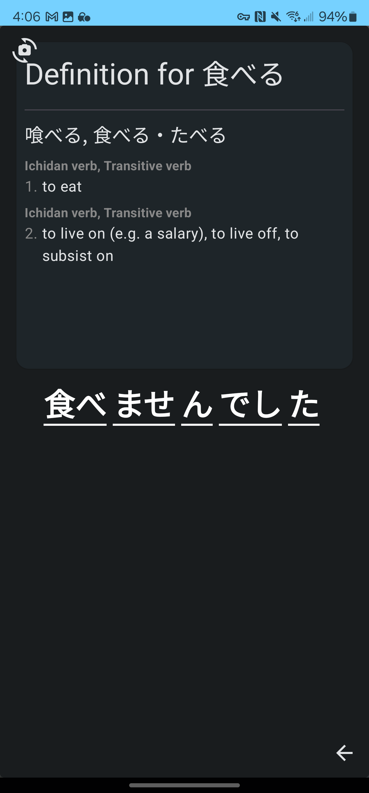

# NihongoLens

NihongoLens is an Android app designed to help users learn Japanese using AI technology. The app utilizes your device's camera to provide real-time translations and language-learning support.

**Please note that this project is currently under development and no releases have been made yet. You can build and run the app locally by following the steps below.**

## Features
- Real-time OCR (Optical Character Recognition) powered by Google MLKit
- Tokenization using Kuromoji for accurate language parsing
- Jetpack libraries for a modern Android development experience
- Material Design for a sleek and intuitive user interface
- Room for local database storage
- Dependency injection with Hilt for efficient and testable code
- GitHub Actions for automated testing and continuous integration (CI)

## Development Screenshots

    
    

## Getting Started
1. Clone the repository: `git clone https://github.com/reedsloan/NihongoLens/NihongoLens.git`
2. Open the project in Android Studio 2023.2.1 or later
4. Build and run the app on your device or emulator

## Plans

In future releases, I plan to enhance NihongoLens with the following features:

1. **Google Translations:** Integrate Google Translate API to provide accurate translations for scanned text.

2. **Google Vision API:** Utilize the Google Vision API for improved OCR (Optical Character Recognition) capabilities.

3. **ChatGPT Breakdowns:** Implement ChatGPT to provide breakdowns and explanations of scanned sentences, aiding in language learning and comprehension.

Stay tuned for updates!

## Contributing
When the project is in a more complete state and I feel it's worthwhile I will prepare relevant info.
